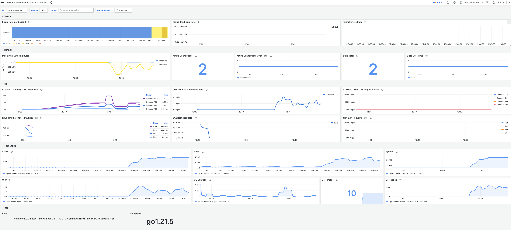

# Running Sauce Connect 5 with Prometheus and Grafana

Run [Sauce Connect 5](https://docs.saucelabs.com/secure-connections/sauce-connect-5/) and export [Prometheus](https://prometheus.io/) metrics to a [Grafana](http://grafana.org/) dashboard.

The dashboard is available at [Grafana Dashboards](https://grafana.com/grafana/dashboards/20232-sauce-connect/).

## Setup

Set the following required Sauce Connect 5 environment variables, see details in the [Sauce Connect 5 CLI documentation](https://docs.saucelabs.com/dev/cli/sauce-connect-5/run/):

- `SAUCE_REGION` - Sauce Labs region, one of us-west, eu-central, etc.
- `SAUCE_TUNNEL_NAME` - Sauce Connect Tunnel Pool name
- `SAUCE_USERNAME` - Sauce Labs username
- `SAUCE_ACCESS_KEY` - Sauce Labs access key

Set the following docker compose variables, see details in the [Docker Compose documentation](https://docs.docker.com/)
- `--no-log-prefix` will configure Docker Compose to not prepend Sauce Connect Proxy stdout with the container name.

```sh
SAUCE_USERNAME=foo SAUCE_ACCESS_KEY=xxxx SAUCE_TUNNEL_NAME=sc-prom-grafana SAUCE_REGION=us-west docker-compose up --no-log-prefix
```

## Sauce Connect Dashboard

The Sauce Connect Grafana dashboard is available at http://localhost:3000/d/sauce-connect/sauce-connect. Login with user: _admin_, password: _admin_, or change the credentials in `./grafana/config.monitoring`.


