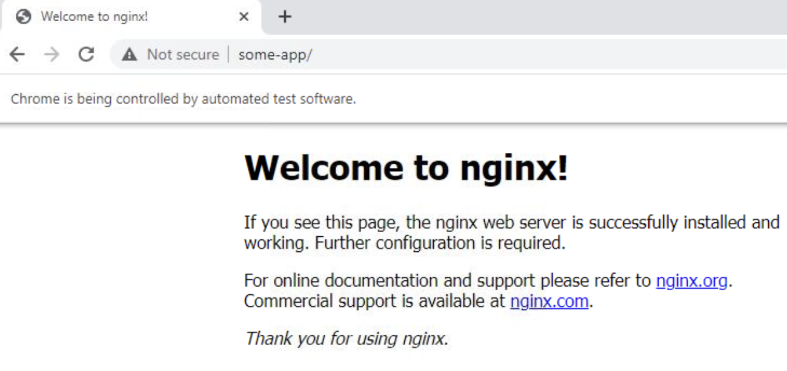

## Running an Nginx Server Alongside Sauce Connect Proxy

This is a demo example of running an Nginx Server with Sauce Connect Proxy.
This example configuration allows you to use a tunnel while launching a Desktop or Web Mobile test, then go to the `http://some-app` URL to access the Nginx container.

You can also provide a name to the container with different [container_name](https://docs.docker.com/compose/compose-file/compose-file-v3/#container_name).

The example uses the following Docker Compose flags:

- `--no-log-prefix` will configure Docker Compose to not prepend Sauce Connect Proxy stdout with the container name

 See the [Docker Compose documentation](https://docs.docker.com/engine/reference/commandline/compose_up/) for more info.

The example uses the following environment variables:

- `SAUCE_REGION` - Sauce Labs region, one of us-west, eu-central, etc.
- `SAUCE_TUNNEL_NAME` - Sauce Connect Tunnel Pool name
- `SAUCE_USERNAME` - Sauce Labs username
- `SAUCE_ACCESS_KEY` - Sauce Labs access key

See the [Sauce Connect documentation](https://docs.saucelabs.com/dev/cli/sauce-connect-proxy/) for more environment variables

```sh
SAUCE_USERNAME=foo SAUCE_ACCESS_KEY=xxxx SAUCE_TUNNEL_NAME=my-nginx-over-sc SAUCE_REGION=us-west docker-compose up --no-log-prefix --pull always
…
Sauce Connect runtime information:
 - Name: composed-docker-sc
 - PID: 8
 - PID file: /tmp/sc_client-composed-docker-sc.pid
 - Log file: -
 - SCProxy Port: 37037
 - Status Port: 8032
 - Selenium listener: None
 - External proxy: None
 - Tunnel proxy: None
 - Region: us-west
…
```

Now the Nginx Server is available to the host on port 3333 and also to Sauce Labs VMs over the Sauce Connect.


